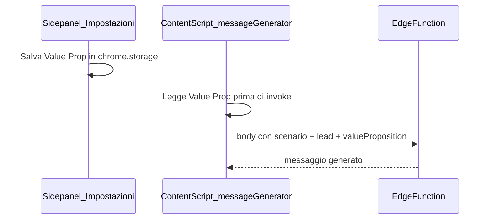

# Piano: AI messaggistica (aggiornato UX + "chi sono io")

## Modifiche rispetto alla versione precedente

### 1. Menu: click, non hover

- **Problema evitato**: sulla barra chat ci si muove in fretta; un menu che si apre al passaggio del mouse genera aperture accidentali e frustrazione.
- **Comportamento**: **click** sul bottone "Genera con AI" → si apre/chiude il menu con le 3 opzioni → **click** sull’opzione → generazione (o conferma).
- **Dettagli UX consigliati**:
  - Secondo click sullo stesso bottone chiude il menu (toggle).
  - `Escape` chiude il menu.
  - Click fuori dal menu (document / overlay) chiude il menu.
  - Accessibilità: `aria-expanded`, `aria-haspopup="menu"`, focus trap opzionale in iterazione successiva.

### 2. "Chi sono io?" — Impostazioni nel CRM (non placeholder)

- **Problema evitato**: senza contesto sulla tua startup, il modello **inventa** value proposition e settore.
- **Soluzione**: prima della versione definitiva di generazione, aggiungere un piccolo **pannello Impostazioni** nel sidepanel CRM (es. sezione in `sidepanel.html` + logica in [`src/moduli/crm.ts`](src/moduli/crm.ts) o modulo dedicato `userSettings.ts`).
- **Contenuto minimo**: 1–2 righe di **Value Proposition** (es. "Siamo un'agenzia che fa X per Y"). Opzionale in seguito: nome startup, sito, tono.
- **Persistenza**:
  - **Consigliato per MVP**: `chrome.storage.local` (o `sync` se vuoi sincronizzare tra dispositivi Chrome con lo stesso account) — chiave tipo `ln_user_value_prop`.
  - **Alternativa / evolutiva**: tabella Supabase `user_settings` (una riga per utente) se in futuro aggiungi auth; finché l’app è single-user con anon key, lo storage dell’estensione è sufficiente.
- **Uso**: a ogni chiamata alla Edge Function, includere nel body `valueProposition` (e altri campi utente se presenti). Il prompt system in [.cursorrules](.cursorrules) resta allineato; il **contesto "tu"** diventa input strutturato obbligatorio prima di considerare la feature "completa".

---

## Architettura (invariata sul fondo)

- **Supabase Edge Function** `generate-linkedin-message`: chiave LLM solo lato server; body include `scenario`, dati lead, `triggerText` opzionale, **`valueProposition`** (da Impostazioni).
- **Estensione**: `supabase.functions.invoke` dal content script (o modulo condiviso), con `host_permissions` verso `*.supabase.co` se richiesto dal build MV3.

---

## Ordine di lavoro aggiornato

1. **Impostazioni CRM** (value proposition + lettura nello script che invoca la generazione).
2. **UI messaggistica**: bottone + **menu a tendina su click** (3 opzioni), stili in `style.css`.
3. **Contesto lead** (`messagingContext.ts`): DOM + query CRM per Trigger.
4. **Inserimento nel composer** LinkedIn.
5. **Edge Function** + prompt da `.cursorrules` + campo obbligatorio `valueProposition`.
6. **Wire** `functions.invoke` + manifest.
7. Test end-to-end.

---

## Todo (sintetico)

- [ ] Pannello Impostazioni CRM + persistenza value proposition (`chrome.storage`)
- [ ] Menu 3 opzioni su **click** (toggle, fuori-click, Escape)
- [ ] `messagingContext` + Trigger da Supabase
- [ ] Edge Function con `valueProposition` nel body
- [ ] Composer insert + test reale su `/messaging`
